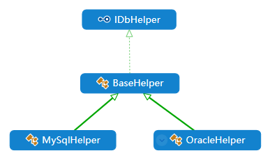
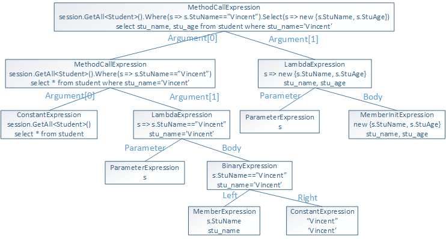
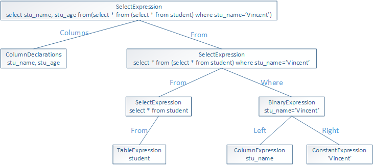

# 体检系统数据访问层：一个ORM持久化框架的设计与实现

## 摘要

ORM（Object Relational Mapping，对象关系映射）是一种程序设计技术，用于实现面向对象编程语言里不同类型系统的数据之间的转换。从效果上说，它其实是创建了一个可在编程语言里使用的“虚拟对象数据库”。

在体检系统的开发过程中，暴露出许多问题，它们对于软件系统的安全性以及可维护性都造成了一定的影响。本文吸取了体检系统的经验教训，并以其数据访问层的部分代码为核心，开发了一个较为完整的ORM持久化框架。本框架具有数据库连接管理、事务控制、多数据库支持、对象存取、Linq查询等功能，为了实现这些功能，我们使用到了面向接口编程、动态代理等技术。

关键字：软件工程，对象关系映射，面向接口编程，动态代理

## Abstract

ORM (Object Relational Mapping) in computer science is a programming technique for converting data between incompatible type systems in object-oriented programming languages. This creates, in effect, a "virtual object database" that can be used from within the programming language.

In the developing of Physical Examination Information System, we encounted many problems which influenced the safety and maintainability of the software system to some extent. This thesis develops a complete ORM persistence framework based on the experience of Physical Examination System and some code of its data access layer. The framework supports database connection management, transaction control, multi databases, object saving and retrieving, Linq query, etc. To implement these, we uses the technique of interface-oriented programming, dynamic proxy, etc.

Key Words: Software Engineering, Object Relational Mapping, Interface-oriented Programming, Dynamic Proxy

## 引言

软件开发过程中，在程序中对数据库进行访问是十分普遍的行为。一个以数据为中心的软件系统，几乎处处都是数据库访问的代码。这些数据访问代码实现了软件系统的业务逻辑，形成了庞大的代码库，支撑起了信息化时代形形色色的信息系统。下面介绍几种常见的数据库访问方式。

### 传统数据库访问方式及其优劣

传统的数据库访问方式是指不通过中间层，直接对数据库进行操作的方式。Java中的JDBC和C#中的ADO.NET都是这种方式的典型代表。传统的数据库访问方式的典型步骤包括：加载数据库连接驱动，创建连接，创建数据库命令对象并为其赋予参数，执行命令并读取执行结果，关闭连接。

使用这种数据库访问方式的缺点是显而易见的，那就是充斥着大量冗余的模版代码。里面真正与我们的业务相关的只有一两句话，而我们却不得不为此写一大段模版性的代码来处理数据库连接的开启与关闭等操作。当我们只需要偶尔访问一次数据库的时候，时候这种方式也无可厚非，但是，随着业务的增长，访问数据库的次数也随之增加，系统中的冗余代码也会大量增长，这显然是不具有可维护性的。另外，这种方式还会使我们的代码与特定的数据库耦合在一起，因为不同的数据库会有不同的API，如果日后有更换数据库的需求，这种耦合必然也会造成维护上的困难。

当然，传统的数据库访问方式也并非一无是处。由于业务代码直接操作数据库，其中没有任何中间层，因此它较之其他的数据库访问方式，最大的优点是性能上的优势。然而，由于计算机硬件的发展，这点优势也变得微不足道，因此，除了少数对性能有严苛的要求的场景，极少有系统会采用这种数据库访问方式。

### 使用DbHelper工具类的方式

DbHelper工具类是位于业务逻辑代码与数据库访问代码之间的一个中间层，它采用模块化编程的思想，封装了传统数据库访问方式中的模板化代码，提供了一系列实用的函数以供调用。在使用时，只需要向其提供要执行的SQL语句及其参数即可。这种数据库访问方式避免了编写传统数据库访问方式中的大量冗余代码，同时得益于中间层相对简单，其性能也可与前者媲美。由于其方便使用，学习成本低，因此在体检系统开发的前期，我们曾大量使用了这种数据库访问方式。我们不仅可以使用自己开发的DbHelper工具类，还可以使用各种第三方的数据库访问工具，它们简单灵活，功能多样，因此有大量的信息系统采用这种方式。

然而，这种方式还是有一定的耦合度，我们的SQL是直接硬编码在代码中的，当数据库的结构发生改变时，我们就不得不修改遍布整个项目的SQL语句，这样极易导致错误。而且，不同数据库之间的SQL语法并不兼容，使用这种方式也无法消除代码与数据库之间的耦合。

### 使用ORM框架的意义

近些年来，面向对象的程序设计方法大行其道，我们希望能够在程序中将数据也作为对象来进行操作。然而，在数据库方面，虽然NoSQL数据库也开始兴起，但是主流的数据库仍然是关系型数据库，仍然使用SQL作为查询语言。为了解决关系型数据库的数据组织形式和面向对象的数据组织形式之间的根本性差异，ORM框架应运而生。ORM的全称是Object Relational Mapping，一般称作“对象-关系映射”，它将数据库中的表映射为编程语言中的类，将表中的字段映射为类中的属性，将外键关联映射为类中的嵌套对象，等等。

使用ORM框架，配置好对象-关系映射之后，我们就可以使用它提供的方法，方便地进行数据库操作。ORM框架会自动发起与关闭数据库连接，自动管理事务，自动将关系型的查询结果封装为对象。有些功能强大的ORM甚至还具有SQL自动生成，反向建库的功能（如Hibernate的反向工程，程序员可以先进行面向对象的建模，然后再由Hibernate自动创建数据表以及约束，程序员甚至完全不用关心具体的表结构，只需要关心领域模型的构建即可）。另外，ORM一般都会具有一套机制，可以避免在代码中直接嵌入SQL，以消除代码与SQL之间的耦合。ORM的出现，在工程上具有极其重大的意义，它能使我们对数据库的操作以自动化的方式进行，极大地提高了软件开发效率，也增强了软件系统的可维护性，程序员在一定程度上甚至成为了流水线上的“装配工人”。

在体检系统开发的后期，由于对自动化事务管理、防止SQL注入、查询结果自动封装等功能的强烈需求，我们不断修改数据访问层中的代码，也逐渐形成了一个自己的小型ORM框架。

## 背景

### 现有的主流ORM框架

如今C#平台上已有了各种各样的ORM框架，它们有着不同的理念与目标，因此功能也各有特点。下面简单介绍几种较为主流ORM。

 - NHibernate：NHibernate由Java平台下广为使用的开源ORM框架Hibernate移植而来，它是一个“重量级”的框架，对数据库结构提供了较为完整的封装，实现了实体类和数据表之间的映射。程序员只需要定义好映射关系，即可通过NHibernate提供的方法完成持久层操作。使用NHibernate，程序员不需要对SQL熟练掌握，甚至完全不需要写SQL，NHibernate会根据指定的存储逻辑，自动生成对应的SQL并调用ADO.NET加以执行。
 - MyBatis.NET:与NHibernate相比，MyBatis提供的是一种“半自动化”的ORM，它的着力点在于实体类与SQL（而不是数据表）之间的映射关系。使用MyBatis，程序员仍然需要在配置文件中手动写SQL，然后通过映射配置文件，将SQL所需的参数，以及返回的结果字段映射到指定的实体类。配置简单，可在SQL粒度上进行性能优化是其主要的优势。
 - Linq to SQL：C#在3.5版本中引入了Linq（Language-Integrated Query， 语言集成查询）的新特性，自此全面支持了函数式的编程方式。Linq to SQL将数据库中的数据视为C#语言中普通的集合，然后我们可以借助lambda表达式（即匿名函数）提供的便利对这些抽象出来的集合进行filter（即Where函数）、map（即Select函数）等经典的函数式操作。最终，一系列链式操作会形成一个Linq表达式，Linq to SQL解析这个表达式，生成合适的SQL送到数据库中执行。其最大的优点在于程序员可使用函数式的编程方式写出极为精简的数据库访问代码，然而缺点也很明显，那就是只支持SQL Server一种数据库。为了弥补这个缺点，微软已推出了Linq to SQL的替代者Entity Framework，它将Linq to SQL的理念进一步发扬光大，同时修复了种种缺点，包括多数据库的支持。

### ORM框架应实现的功能

通过分析现有的各种ORM框架，我们总结出一些功能清单，一个完整的ORM框架通常都会实现它们。我们体检系统的数据访问层也不完全实现了下面的一些特性。

 - 对象关系映射。这是一个ORM必须要具有的基本功能，无论是将实体类映射到数据表还是映射到SQL，ORM框架都必须提供一种机制，用以自动将关系型查询结果封装为对象，或者将对象保存为数据库中的关系型数据。
 - 消除程序代码与SQL的耦合。具体来说，就是尽量避免在代码中直接编写SQL命令。对于这个，不同的ORM有着不同的思想，NHibernate等传统的ORM的解决方式是由框架来生成SQL，避免程序员亲自编写。而MyBatis的实现方式是将SQL配置化，把SQL编写在配置文件中，从而将其从程序代码中分离出来。
 - 多数据库支持。一个完整的ORM应该具有多数据库的支持，以消除程序代码与具体数据库的耦合，在不同的数据库之间切换时，只需更改配置文件即可，不需修改程序代码。具有SQL生成机制的ORM，在支持多数据库的时候，还应该针对当前使用的具体数据库来优化生成的SQL，以充分发挥不同数据库的优势。
 - 数据库连接与事务的自动化管理。一个ORM必须将程序员从创建与关闭数据库连接等模版性代码中解脱出来，使他们专注于业务逻辑，同时还要提供一个事务管理的机制，用以将多个操作组合成事务。出于性能考虑，ORM还可以提供连接池机制。
 - 设计良好的查询API。一套设计良好、使用方便的查询API可以大大减轻程序员的工作量。NHibernate就为此专门设计了一门查询语言HQL，它借鉴了SQL的语法，却是一门面向对象的查询语言，极大地方便了查询代码的编写。另外，DSL（Domain Specific Language，领域专用语言）也是设计查询API的一种思路，前文提到的Linq也就是一种DSL。
 - 缓存机制。许多人不愿意使用ORM的主要原因是较高层次的封装可能会使查询成为性能的瓶颈。为了优化性能，许多ORM都会提供一个缓存机制，用以缓存查询的结果，当同样的SQL再次执行的时候，ORM可能不会再去访问数据库，而改为从缓存中直接获取。当然，可缓存的内容不仅仅是数据，一些对实时性要求不高的操作也可以缓存下来，积累到下次数据库连接发起时再批量执行，以此降低连接发起的频率。
 - 懒加载机制。当我们从数据库取得一个对象时，我们可能并不需要这个对象的所有信息，这时如果还将它们查询出来是一种对性能的浪费，特别是对象中还具有嵌套对象（对应数据库中的外键关系）的情况下，ORM可能还需要生成一个连接查询将嵌套对象的信息一并取出。懒加载就是在取得这个对象的时候，只查询它的一些基本信息，不查询与之关联的其他表以及某些大字段，只有在程序中使用到这些信息的时候，才从数据库中查询。而这一切对于程序员是透明的，程序员只需假设对象中具有他需要的所有信息，不必关心它们是如何查询出来的。

### 技术背景及理论依据

为了实现上述功能，我们需要使用到不同的技术，下面列举一些我们使用到的技术。

 - 反射。反射是指计算机程序在运行时可以访问、检测和修改它本身状态或行为的一种能力。在这里，我们使用到反射的地方主要是读取配置在实体类中的元数据以构建对象和数据表之间的映射信息，以及利用这些映射信息进行对象和关系型数据之间的自动转换。另外，为了解除程序代码与特定数据库的耦合，我们将具体的数据库操作类进行配置化，这时就不能通过常规的方式来创建对象，只能使用反射。总之，反射作为框架构建的基本技术，在一个ORM中几乎处处都有它的身影。
 - 面向接口编程。在C#中，接口是一个包含了方法声明但是没有方法实现的特殊的类，它是一组规则的集合，它规定了实现本接口的类必须拥有的一组规则。我们这里把面向接口编程的思想主要应用在实现多数据库的支持上，根据这种思想，我们访问数据库的底层模块并不是直接向其上层提供服务，而是通过定义一组接口，仅向上层暴露其接口功能，上层对于下层仅仅是接口依赖，而不依赖具体的类。这样做使得系统具有很大的灵活性及扩展性，我们能够随时替换底层的实现，而接口保持不变，体现在我们的框架中，在更换数据库时，只需要更改一下配置文件即可。
 - Linq表达式解析与SQL语法树。微软还为Linq提供了表达式树支持，一条Linq表达式会被表示为一个树形的数据结构，第三方开发者在使用Linq作为其DSL时，直接解析这颗表达式数转换成自己需要的目标语言即可，不需要再进行词法分析和语法分析。在这里，我们使用Linq作为自己的查询API，通过解析Linq表达式树来生成SQL。另外，为了编码的方便，我们将SQL也抽象为一个树形结构，在解析Linq表达式树时，并不直接生成SQL字符串，而是生成一颗SQL表达式树，最后在将这颗表达式树翻译为SQL文本。
 - 动态代理。有时候我们希望拦截某些方法的执行，在这些方法执行之前或之后加入一些特定的处理，比如打印日志或者加入缓存机制等等，这就是所谓AOP（Aspect Oriented Programming，面向切面编程）的思想。使用代理模式可以很方便地实现这一点，比如提供一个被代理类的子类，这个子类重写了父类的所有方法，在里面添加自己的操作，然后再调用父类的方法。这就是利用继承实现的静态代理模式，静态代理模式的缺点在于，对于每一个被代理类，我们都要为其编写一个代理子类。因此，在需要批量对一些类进行统一的代理的时候，就需要使用到动态代理的技术，我们可以使用Emit在运行时动态创建被代理类的子类，在这个动态创建出来的子类中动态添加代理逻辑，也可以使用第三方动态代理类库，提供一个拦截器对象作为拦截的时候执行的操作。在这里我们使用动态代理主要是为了实现懒加载机制，通过拦截属性的访问，我们就能得知数据被访问的时机，做到延迟查询数据库。

## 总体功能设计

### 框架基本配置

使用本框架，首先要将它编译生成的dll文件复制到使用该它的项目中，然后添加对该dll的引用。如果项目使用到的数据库需要依赖其他dll，还需添加这些dll的引用，例如使用MySQL数据库，需要添加MySql.Data.dll。最后，添加一个ini配置文件，配置框架所需的基本信息。

默认的配置文件应位于程序的启动目录，文件名为FrameDAL.ini，也可以在AppContext第一次被调用之前通过Configuration.DefaultPath设置配置文件的路径。下面是一个配置文件的范例：

````ini
	[Settings]
	EnableLazy=true
	EnableCascade=true
	LogFile=FrameDAL.log
	LogAppend=true
	DbHelperAssembly=FrameDAL.dll
	DbHelperClass=FrameDAL.DbHelper.MySqlHelper
	
	[ConnStr]
	server=localhost
	database=test
	user id=root
	password=root
	charset=utf8
````

配置文件主要分为两个节点，一个是Settings，用于配置框架运行所需的基本信息，第二个是ConnStr，用于配置数据库连接字符串。Settings节点下还有许多不同的配置项，下面是它们的具体功能：

 - EnableLazy：启用懒加载的总开关，查询时关联的属性会以此作为默认配置，选择是否启用懒加载。
 - EnableCascade：是否启用级联操作，若启用，对一个对象进行增删改等操作会影响到与其关联的其他对象。
 - LogFile：日志输出目录，框架的运行日志将会输出到此文件，设置为空则不启用日志。
 - LogAppend：日志输出模式，false则每次运行都会都会清空日志文件再输出，true则在原文件末尾添加新日志。
 - DbHelperAssembly：实现了IDbHelper接口的类所在的类库的dll文件名称，不同的数据库具有不同的DbHelper，本框架内置了MySQL、Oracle等常用数据库的DbHelper，也可以使用第三方的扩展，此时这项配置就是第三方DbHelper所在的类库的dll文件名。
 - DbHelperClass：DbHelper类的命名空间限定类名。

ConnStr是数据库连接串的配置项，具体的内容依所使用的数据库不同而定。下面是MySQL中一些配置项的含义：

 - server：数据库服务器的地址。
 - database：数据库名
 - user id：数据库用户名
 - password：数据库密码

### 对象-关系映射配置

作为一个ORM框架，最重要的部分就是“映射”，如何优雅地实现对象与关系数据的映射是ORM框架永恒的主题。现有的主流ORM框架通常都会提供两种配置映射的方式，一种是XML方式，另一种是Attribute元数据标记（在Java中称为Annotation）的方式。本框架支持的是第二种，即直接在实体类上添加Attribute元数据标记来描述它和数据表之间的映射关系。下面以一个简单的业务模型为例，介绍本框架的映射方式设计。

在此例中，具有班级、学生和课程三个实体。班级和学生是一对多的关系，一个班级可以有多个学生，但每个学生只能属于一个班级。体现在表的结构上，student表中具有一个class_id的外键字段，引用了class表的主键。学生和课程是多对多的关系，一个学生可以修多门课程，一门课程也能有多个学生。多对多的关系需要额外使用一张关联表stu_course来表示，这张关联表中只有两个外键字段，分别引用了student表和course表的主键。具体的表结构如下图所示。


现在，我们对这个业务场景进行面向对象的建模，我们分别用Class、Student和Course三个类来表示这三个实体。其中，Class类中应该具有一个Student对象的集合，以表示该班级中的所有学生，Student类中应该具有一个Class类的嵌套对象，以表示该学生所属的班级。另外Student类中还应具有一个Course对象的集合，表示该学生选修的所有课程，同理，Course类中也应该有一个Student对象的集合。将上面的分析转换成C#代码如下。

````C#
	[Table("class")]
    public class Class {
        [Id(GeneratorType.Identity)]
        [Column("id")]
        public virtual int Id { get; set; }

        [Column("class_name")]
        public virtual string ClassName { get; set; }

        [OneToMany("class_id")]
        public virtual List<Student> Students { get; set; }
    }

    [Table("student")]
    public class Student {
        [Id(GeneratorType.Sequence, SeqName = "student_sequence")]
        [Column("id")]
        public virtual int Id { get; set; }

        [Column("stu_name")]
        public virtual string StuName { get; set; }

        [Column("stu_age")]
        public virtual int StuAge { get; set; }

        [ManyToOne("class_id", LazyLoad = false)]
        public virtual Class Class { get; set; }

        [ManyToMany(JoinTable = "stu_course", JoinColumn = "stu_id", InverseJoinColumn = "course_id")]
        public virtual List<Course> Courses { get; set; }
    }

    [Table("course")]
    public class Course {
        [Id(GeneratorType.Identity)]
        [Column("id")]
        public virtual int Id { get; set; }

        [Column("course_name")]
        public virtual string CourseName { get; set; }

        [ManyToMany(JoinTable = "stu_course", JoinColumn = "course_id", InverseJoinColumn = "stu_id")]
        public virtual List<Student> Students { get; set; }
    }
````

上面的代码与普通的C#类并没有太大的区别，唯一的不同在于这些类使用了大量Attribute元数据标记，这些元数据描述了这些类与数据表之间的映射关系。另外，这些Attribute中还具有一些额外的配置项，这些配置项将对框架的运行方式有不同的影响。

下面是各种Attribute的功能说明：

 - Table：TableAttribute用于修饰类，表示这个实体类对应数据库中的一张表或者视图，它接受一个字符串参数作为表名，此参数将用于构造查询的SQL语句。
 - Id：IdAttribute必须与ColumnAttribute一起使用，表示它修饰的属性对应于表中的主键字段。它具有两个参数，GeneratorType参数接受一个枚举值，表示一个特定的主键生成策略，可用值包括Assign（手动赋值）、Uuid（全局唯一ID）、Identity（自增长）和Sequence（序列）。SeqName接受一个字符串，当GeneratorType配置为Sequence时可用，用于指定数据库中用于生成主键的序列名。
 - Column：ColumnAttribute用于修饰属性，表示这个属性对应表或视图中的一个字段。它具有三个参数，Name为字段名，ReadOnly表示此属性是否只读，当设置为只读时，对这个属性作出的修改将无法持久化到数据库，LazyLoad是开启懒加载的开关，对于普通属性，其默认值为false。
 - ManyToOne：ManyToOneAttribute修饰嵌套对象属性，用于表示数据库中的多对一关系。它具有三个参数，ForeignKey表示对应的外键字段的名称，LazyLoad是懒加载的开关，对于关联属性，其默认值为true，Cascade表示级联操作的类型，用于配置对此实体类的修改同步更新到该关联属性的时机。
 - OneToMany：OneToManyAttribute修饰嵌套对象属性，用于表示数据库中的一对多关系。它具有三个参数，InverseForeignKey表示外键字段的名称，LazyLoad是懒加载的开关，Cascade表示级联操作的类型。
 - ManyToMany：ManyToManyAttribute修饰嵌套对象属性，用于表示数据库中的多对多关系。它具有五个参数，JoinTable表示关联表的表名，JoinColumn表示指向本表主键的外键名，InverseJoinColumn表示指向另一端的表的主键的外键名，LazyLoad是懒加载的开关，Cascade是级联操作的类型。

配置映射关系是使用ORM框架的第一个步骤，这种使用Attribute元数据标记作为映射方式的设计简单便捷，学习成本低。配置好映射关系之后，就可以使用框架提供的API方便地进行数据持久化操作了。

### 核心API与增删改操作

AppContext类是使用框架的功能的入口，由于使用了单例模式，因此在整个程序的生命周期，只有一个此类的实例，即全局上下文对象。它的功能主要是读取框架配置信息创建Configuration对象，读取并缓存配置在Attribute元数据标记中的映射信息，以及提供一些便捷的工具方法。作为创建Session对象的工厂，它还具有会话管理的功能。此外，AppContext对象还保存了一个DbHelper对象的实例，我们可以使用它方便地进行比较底层的数据库操作。

Session抽象出了数据库会话的概念，它代表一个完整的业务操作。Session具有连接管理的功能，在一个会话中，可以有一次或多次数据库操作，会话会根据需要自行打开或关闭连接。另外，会话还具有一个操作缓存，可将多个数据库操作缓存起来，等到合适的时间再批量执行，以降低建立数据库连接的频率。

Session对象可通过AppContext对象获得，获得Session对象之后，我们就可以使用它提供的方法，对实体进行各种CURD操作。下面是往数据库中保存一个学生对象的例子：

````C#
	AppContext context = AppContext.Instance;
    using (ISession session = context.OpenSession()) {
        Student student = new Student();
        student.StuName = "Vincent";
        student.StuAge = 20;
        student.Class = new Class { ClassName = "信息工程" };
        student.Courses = new List<Course>();
        student.Courses.Add(new Course() { CourseName = "数据库原理" });
		
        session.Add(student);
    }
````

上面的代码首先获得了全局上下文对象，通过这个对象打开了一个数据库会话，然后创建了一个Student实体对象，并且给这个对象填充了各种信息，包括与之关联的Class对象与Course集合的信息，最后调用Add方法将该实体保存到数据库。代码执行的结果是在class表和course表中分别插入关联的数据，在再student表中插入该实体的数据，其中class_id外键字段保存了刚刚在class表中插入的数据的主键，最后再在stu_course关联表中插入student与course之间的关联。如此复杂的多表插入操作，得益于框架的帮助，只需要调用一个Add方法，即可自动完成。

修改一个实体类的信息也十分简单：

````C#
	Student student = session.Get<Student>(23);
    student.StuAge = 21;
    student.Courses.Clear();
    session.Update(student);
````

上面的代码先通过Get方法从数据库中取出了Id为23的学生，然后将该学生的年龄修改为21岁，清除他选修的所有课程，再调用Update方法将所作的改动保存到数据库。代码执行的结果是student表中该条记录的stu_age字段被修改为21，关联表stu_course中所有与该学生对应的关联信息都被清除，但是course表中的记录还会保留，因为可能也有其他学生选修了这些课程。

删除一个实体的代码也是只需调用一个Delete方法即可：

````C#
	Student student = session.Get<Student>(23);
    session.Delete(student);
````

上面的代码不仅删除了student表中的这条记录，还会同时清除关联表stu_course中的记录，避免数据库中残留无用数据。

### 事务控制

在一个Session中进行多次操作默认是不具备事务性的，如果在操作期间发生了异常，那么已经完成的操作将无法回滚。因此，当我们的某些业务逻辑对事务性有要求时，就需要我们手动进行事务控制，Session中具有事务控制相关的API，下面是它们的使用范例：

````C#
	try {
        session.BeginTransaction();
        // ACID operations...
        session.CommitTransaction();
    } catch {
        session.RollbackTransaction();
        throw;
    }
````

这里使用了一个try-catch语句块，我们首先调用BeginTransaction方法开启事务，再进行具体的业务操作，最后调用CommitTransaction方法提交事务，若其中发生了异常，则跳转到catch语句中，在里面进行RollbackTransaction回滚事务，并且用throw语句将异常抛出，使外界得知异常的发生。把我们的业务代码用上述语句包裹起来，就可拥有事务的ACID特性，即原子性（atomicity）、一致性（consistency）、隔离性（isolation）和持久性（durability）。

Session把事务控制从数据访问层提升到了业务逻辑层，使程序员不需要管理数据库连接就可进行事务控制，但即便如此，显式的事务控制代码还是太模板化，显得有点冗余。因此，AppContext类提供了DoTransactional方法，调用这个方法，传入一个委托作为参数，这个委托中的代码就会在事务中执行。配合C# 3.0新增的lambda表达式的特性，事务控制的代码就能变得十分简洁。

````C#
	context.DoTransactional(session => {
        // ACID operations...
    });
````

### LINQ查询

查询是发生最频繁的数据库操作，本框架使用Linq作为标准查询API，因此适用于Linq的写法，大部分都可用于本框架中的数据库查询。要使用Linq查询，首先要获得一个IQueryable对象，Session中的GetAll方法就是获得一个默认的IQueryable对象的方法，它表示返回指定实体类所有对象的默认查询。我们可以在这个默认的查询上调用Where方法，传入一个lambda表达式作为谓词，就得到一个具有指定的筛选条件的查询，比如：

````C#
	var query = session.GetAll<Student>().Where(s => s.StuName == "Vincent");
````

上面的查询返回所有名字为Vincent的Student对象。我们还可以在新的查询对象上继续调用Where方法进一步地筛选结果，或者调用Select方法对结果作投影操作，最终会形成一连串的链式方法调用，如：

````C#
	var query = session.GetAll<Student>()
        .Where(s => s.StuName == "Vincent")
        .Where(s => s.StuAge > 18)
        .Select(s => new { s.StuName, s.StuAge });
````

上面的查询将返回所有名字为Vincent并且年龄大于18的学生的名字和年龄。C#还提供了一系列关键字，用于简化这种链式方法调用的编写，下面的查询与上面的链式调用是等效的。

````C#
	var query = from s in session.GetAll<Student>()
                where s.StuName == "Vincent"
                where s.StuAge > 18
                select new { s.StuName, s.StuAge };
````

可以看到，Linq与SQL在语法上具有一定的相似性，这对于熟悉SQL的程序员来说，只需略加学习就可上手使用。另外，本框架还支持了Linq中的连接查询、排序、分页等操作，这样，把各种操作组合在一起，就能实现一些比较复杂的查询，如：

````C#
	var query = session.GetAll<Student>()
	    .Where(s => s.StuAge > 18 && s.StuAge < 20)
	    .OrderBy(s => s.StuAge)
	    .ThenBy(s => s.Id)
	    .Skip(2)
	    .Take(2);
````

使用Linq查询，不仅可以避免直接在代码中编写SQL，而且受益于编译期检查，写出类型安全的查询也会比较容易。

### SQL查询

无论Linq有多么方便，它始终无法完全代替SQL。因为由程序生成的的SQL对DBA十分不友好，难以进行优化，在一些特殊的场景中，还是有在SQL粒度上进行性能优化的需求，但又不希望失去ORM带来的便利性。这也是Hibernate早期希望HQL作为面向对象的查询语言，能够完全取代SQL的使用，但后来又不得不提供SQL查询相关的API的原因。

使用SQL查询，首先要通过Session的CreateSQLQuery方法创建一个SQL查询对象，然后指定SQL语句以及查询参数，最后调用ExecuteGetEntity或ExecuteGetList方法，指定类型参数，就可以执行查询，并且将查询结果直接转化为对象。

````C#
	ISqlQuery query = session.CreateSqlQuery();
    query.SqlText = "select * from student where stu_name=?";
    query.Parameters = new object[] { "Vincent" };

    List<Student> students = query.ExecuteGetList<Student>();
    Shell.WriteLine(student.Courses.Count.ToString());
````

上面的查询从数据库中取出姓名为Vincent的Student对象。懒加载在使用SQL查询的时候也能起到作用，上面的SQL命令中并没有显式查询出任何与课程有关的信息，但是student.Courses这句话却能够取出该学生选修的所有课程，这是懒加载机制在后台起作用，在调用student.Courses时，框架会通过该学生的ID从course表中查询出需要的数据。但是，这一切对程序员都是自动化而且透明的，程序员不需要做任何额外的操作。

不同的数据库对于分页的处理是不同的，如MySQL使用limit子句，而Oracle是通过rownum进行分页。SqlQuery对这种情况也提供了一定的支持，只需要设置query对象的FirstResult以及PageSize属性的值，框架即可为你拼接好分页查询的SQL。

````C#
	ISqlQuery query = session.CreateSqlQuery("select * from student where stu_age>?", 18);
    query.FirstResult = 10;
    query.PageSize = 10;
    List<Student> students = query.ExecuteGetList<Student>();
````

有时候我们需要把查询结果封装到一个临时的类中，而这个类并没有配置Attribute元数据，因为你只打算使用它来临时保存数据，并不作为实体类使用。这时，使用SqlQuery中提供的ResultMap，在里面指定属性与SQL返回的字段的映射关系，就可以方便地完成结果封装，如：

````C#
	class StudentInfo {
        public string Name { get; set; }
        public int Age { get; set; }
    }

    public void TestResultMap() {
        ISqlQuery query = session.CreateSqlQuery("select stu_name, stu_age from student");
        query.ResultMap = new Dictionary<string, string>();
        query.ResultMap["Name"] = "stu_name";
        query.ResultMap["Age"] = "stu_age";
        List<StudentInfo> students = query.ExecuteGetList<StudentInfo>();
    }
````

## 主要技术难点与实现方式

### 多数据库的支持

在C#中，不同的数据库具有不同的DbConnection以及不同的数据库访问API，因此也有不同的访问方式。另外，对于参数化SQL的使用方式，不同的数据库也有不同，比如Oracle数据库中使用问号作为SQL中的置位符，然后将参数按照置位符的顺序传入，如“select stu_age from student where stu_name=?”。但是MySQL与SQL Server等其他数据库却使用@符号加参数名的方式，传入参数时需要指定不同参数名所对应的值，如“select stu_age from student where stu_name=@nameParam”。因此，同时支持多种数据库，并且在这些数据库之间灵活地切换，需要一些特别的实现方式。

我们先抽象出一个IDbHelper接口，它是本框架的基础模块，为上层的Session以及查询等模块提供支持。抽象出接口的好处显而易见，可以使上层模块不依赖于DbHelper模块的具体实现，并且可以在不同的实现中切换。此接口需要具备的功能包括，数据库连接管理、事务管理、SQL命令预处理、基本的命令执行方法等等。为了统一参数化SQL的使用方式，我们选择了问号置位符的方式，对于使用参数名的数据库，在各自的实现类中进行转换即可。

````C#
	public interface IDbHelper {
        string ConnectionString { get; set; }
        IDialect Dialect { get; }
        DbConnection NewConnection();
        DbCommand PrepareCommand(DbConnection conn, DbTransaction trans, string sqlText, params object[] parameters);
        DbDataAdapter NewDataAdapter(DbCommand cmd);
        bool InTransaction();
        void BeginTransaction();
        void CommitTransaction();
        void RollbackTransaction();
        int ExecuteNonQuery(string sqlText, params object[] parameters);
        object ExecuteScalar(string sqlText, params object[] parameters);
        T ExecuteReader<T>(string sqlText, object[] parameters, Func<DbDataReader, T> func);
        DataSet ExecuteGetDataSet(string sqlText, params object[] parameters);
        DataTable ExecuteGetDataTable(string sqlText, params object[] parameters);
        void DoInCurrentTransaction(Action<DbConnection, DbTransaction> action);
        T DoInCurrentTransaction<T>(Func<DbConnection, DbTransaction, T> func);
    }
````

抽象出一个确定的接口之后，不同数据库的DbHelper类只需要实现这个接口，就可以为上层模块提供服务了。但是，不同数据库的操作方式虽然存在差异，但还是有许多相同的逻辑，比如数据库连接管理与事务管理，其实无论什么数据库都是相同的逻辑，区别只是创建数据库连接的方式不同而已。因此，我们将这些相同的逻辑提取出来，放到一个抽象的基类BaseHelper中，再把不同的逻辑声明为抽象方法，在各自的子类中分别实现，这就是基于继承的代码复用技术——模版方法（Template Method）设计模式。

````C#
	public abstract class BaseHelper : IDbHelper {
        public abstract IDialect Dialect { get; }
        public abstract DbConnection NewConnection();
        public abstract DbCommand PrepareCommand(DbConnection conn, DbTransaction trans, string sqlText, params object[] parameters);
        public abstract DbDataAdapter NewDataAdapter(DbCommand cmd);

        public string ConnectionString { get; set; }

        protected BaseHelper() { }

        protected BaseHelper(string connStr) {
            this.ConnectionString = connStr;
        }

        protected class Bundle {
            public DbConnection Connection { get; set; }
            public DbTransaction Transaction { get; set; }
            public int Tier { get; set; }
        }

        protected ThreadLocal<Bundle> local = new ThreadLocal<Bundle>();

        protected int GetTransactionTier() {
            return InTransaction() ? local.Value.Tier : 0;
        }

        public virtual bool InTransaction() {
            return local.IsValueCreated && local.Value != null;
        }

        public virtual void BeginTransaction() {
            if (GetTransactionTier() == 0) {
                Bundle bundle = new Bundle();
                bundle.Connection = NewConnection();
                bundle.Connection.Open();
                bundle.Transaction = bundle.Connection.BeginTransaction();
                bundle.Tier = 1;
                local.Value = bundle;
            } else {
                local.Value.Tier++;
            }
        }

        public virtual void CommitTransaction() {
            int tier = GetTransactionTier();
            if (tier == 0) throw new InvalidOperationException("非法操作，事务尚未开启。");
            if (tier == 1) {
                Bundle bundle = local.Value;
                local.Value = null;
                bundle.Transaction.Commit();
                bundle.Connection.Close();
            } else {
                local.Value.Tier--;
            }
        }

        public virtual void RollbackTransaction() {
            int tier = GetTransactionTier();
            if (tier == 0) throw new InvalidOperationException("非法操作，事务尚未开启。");
            if (tier == 1) {
                Bundle bundle = local.Value;
                local.Value = null;
                bundle.Transaction.Rollback();
                bundle.Connection.Close();
            } else {
                local.Value.Tier--;
            }
        }

        public virtual int ExecuteNonQuery(string sqlText, params object[] parameters) {
            if (InTransaction()) {
                Bundle bundle = local.Value;
                return PrepareCommand(bundle.Connection, bundle.Transaction, sqlText, parameters).ExecuteNonQuery();
            } else {
                using (DbConnection conn = NewConnection()) {
                    conn.Open();
                    return PrepareCommand(conn, null, sqlText, parameters).ExecuteNonQuery();
                }
            }
        }

		// 省略其他方法的实现
    }
````

由于篇幅限制，这里只展示了BaseHelper类的一部分——事务管理。可以看到，已实现的方法里面调用了一些抽象方法，比如NewConnection、PrepareCommand，这些抽象方法将留待子类实现。有了BaseHelper的大部分公共代码，具体的DbHelper类就只需要实现它自己特有的那一部分就好了，下面是MySqlHelper的实现。

````C#
	public class MySqlHelper : BaseHelper {
        private IDialect _Dialect;

        public override IDialect Dialect { get { return _Dialect; } }

        public MySqlHelper(string connStr) : base(connStr) {
            _Dialect = new MySqlDialect();
        }

        public override DbConnection NewConnection() {
            return new MySqlConnection(ConnectionString);
        }

        public override DbCommand PrepareCommand(DbConnection conn, DbTransaction trans, string sqlText, params object[] parameters) {
            DbCommand cmd = new MySqlCommand();
            if (conn != null) cmd.Connection = conn;
            if (trans != null) cmd.Transaction = trans;

            cmd.CommandText = sqlText;
            if (parameters != null && parameters.Length != 0) {
                AddParamsToCmd(cmd as MySqlCommand, parameters);
            }
            return cmd;
        }

        public override DbDataAdapter NewDataAdapter(DbCommand cmd) {
            return new MySqlDataAdapter(cmd as MySqlCommand);
        }

        private void AddParamsToList(List<object> arr, ICollection parameters) {
            foreach (object param in parameters) {
                if (param is ICollection && !(param is byte[])) {
                    AddParamsToList(arr, param as ICollection);
                } else {
                    if(param == null)
                        throw new NotSupportedException("查询参数列表中有元素为null。");
                    arr.Add(param == null ? DBNull.Value : param);
                }
            }
        }

        private void AddParamsToCmd(MySqlCommand cmd, object[] parameters) {
            List<object> arr = new List<object>();
            AddParamsToList(arr, parameters);

            StringBuilder sb = new StringBuilder();
            string[] temp = cmd.CommandText.Split('?');
            for (int i = 0; i < temp.Length - 1; i++) {
                string paramName = "@param" + i;
                sb.Append(temp[i] + paramName);
                cmd.Parameters.AddWithValue(paramName, arr[i]);
            }
            sb.Append(temp[temp.Length - 1]);
            cmd.CommandText = sb.ToString();
        }
    }
````

可以看到，对于NewConnection、NewDataAdapter等方法的实现，我们只是简单地创建了一个MySqlConnection或者MySQLDataAdapter对象。在PrepareCommand方法的实现中，我们调用了AddParamsToCmd方法，把问号置位符表示的参数化SQL字符串转换为以参数名表示的形式，将具体的查询参数以名-值对的形式添加到MySqlCommand对象中。

OracleHelper中对于NewConnection、NewDataAdapter等方法的实现与MySqlHelper类似，但对于PrepareCommand方法，却有着不同的实现。因为Oracle数据库本来就是使用问号置位符，因此不需要特别的转换，只需要将参数添加到OleDbCommand对象中即可。

````C#
	public class OracleHelper : BaseHelper {
        private IDialect _Dialect;

        public override IDialect Dialect { get { return _Dialect; } }

        public OracleHelper(string connStr) : base(connStr) {
            _Dialect = new OracleDialect();
        }

        public override DbConnection NewConnection() {
            return new OleDbConnection(ConnectionString);
        }

        public override DbCommand PrepareCommand(DbConnection conn, DbTransaction trans, string sqlText, params object[] parameters) {
            DbCommand cmd = new OleDbCommand();
            if (conn != null) cmd.Connection = conn;
            if (trans != null) cmd.Transaction = trans;

            cmd.CommandText = sqlText;
            if (parameters != null && parameters.Length != 0) {
                AddParamsToCmd(cmd as OleDbCommand, parameters);
            }
            return cmd;
        }

        public override DbDataAdapter NewDataAdapter(DbCommand cmd) {
            return new OleDbDataAdapter(cmd as OleDbCommand);
        }

        private void AddParamsToCmd(OleDbCommand cmd, ICollection parameters) {
            foreach (object param in parameters) {
                if (param is ICollection && !(param is byte[])) {
                    AddParamsToCmd(cmd, param as ICollection);
                } else {
                    cmd.Parameters.AddWithValue(null, param == null ? DBNull.Value : param);
                }
            }
        }
    }
````

最终，这一系列的类与接口形成了如下图的继承结构。IDbHelper接口规定了一个DbHelper类所具有的基本功能，抽象类BaseHelper继承了IDbHelper接口，实现了部分可重用的方法，把其他方法声明为抽象方法，MySqlHelper和OracleHelper继承了BaseHelper类，各自实现了BaseHelper中的抽象方法。



现在我们已经有了不同的DbHelper类，要如何把它们应用到框架中来呢？我们是通过配置化来实现这一点的。在配置文件中配置好要使用的DbHelper类所在的程序集及其命名空间限定类名，如将DbHelperAssembly设置为FrameDAL.dll，将DbHelperClass设置为FrameDAL.DbHelper.MySqlHelper。AppContext类在加载配置文件后，会根据配置的内容使用反射创建指定的DbHelper对象。

````C#
	Assembly assembly = Assembly.LoadFrom(config.DbHelperAssembly);
	Type type = assembly.GetType(config.DbHelperClass, true);
	IDbHelper db = Activator.CreateInstance(type) as IDbHelper;
````

如此，就可以通过配置化的方式解除程序代码与具体数据库的耦合，而且，这种设计对于第三方扩展也是友好的。如果要扩展此框架，增加对其他数据库的支持，可以另外编写一个实现了IDbHelper接口的类（可以选择从BaseHelper类继承，也可以完全重新实现），然后在配置文件中配置好改类所属的程序集及其类名就可以了。这种设计符合设计模式中的开闭原则（OCP），即对扩展开放，对修改封闭。

### 懒加载的实现

实现透明的懒加载机制，主要的思路是通过动态代理创建一个实体类的子类对象，这个对象代理了这个实体类的所有方法，因此能得知需懒加载的属性的访问时机，从数据库中查询数据。接下来先以基于继承的静态代理模式为例，介绍代理模式的运行方式，然后再将其扩展到动态代理。

在一个Student类中，有两个属性，一个是普通属性Name，另一个是关联属性Course，因为Course的数据存在于另一个表，把所有数据都查询出来会有一定的性能开销，因此希望对这个属性开启懒加载，等到真正需要的时候才进行查询。为了实现这一点，我们在返回查询结果的时候，并不直接返回一个Student对象，而是另外创建一个它的子类StudentProxy，返回这个子类的对象。

````C#
	public class Student {
        public virtual string Name { get; set; }
        public virtual List<Course> Courses { get; set; }
    }

    public class StudentProxy : Student {
        public override string Name {
            get { return base.Name; }
            set { base.Name = value; }
        }

        private List<Course> courses;

        public override List<Course> Courses {
            get {
                if(courses == null) {
                    courses = LoadCoursesFromDatabase();
                }
                return courses;
            }

            set {
                courses = value;
            }
        }
    }
````

StudentProxy重写了Student中的两个属性，因为Name属性不需要懒加载，因此只是简单地对父类中的属性进行调用。而Courses属性的访问器却有所不同，当Courses属性被访问时，程序首先检查对象中是否已存在courses数据，若不存在，则从数据库中加载相应的信息。若Courses属性没有被使用过，则永远也不会再次访问数据库。这就是使用代理模式实现懒加载的基本原理。这种实现方式对于程序员是透明的，程序员获得的虽然是StudentProxy而不是Student的对象，但是它们具有相同的接口，因此对外的表现是完全一致的。这种基于继承的代理模式，要求被代理的方法必须是可重写的，这就是框架要求实体类不可使用sealed修饰符，而且开启懒加载的字段必须使用virtual关键字的原因，这是因为sealed关键字会阻止继承，非virtual的属性无法被重写。

静态代理的技术虽然实现简单，但是却无法真正应用到ORM框架的懒加载实现中，因为静态代理需要为每一个类都编写一个代理子类，框架显然不能要求程序员自己来编写这些代理类。这时候动态代理的作用就体现出来了，动态代理可以在运行时生成IL代码，创建指定类的代理子类。实现动态代理，可以使用C#反射类库中内置的Emit，也可以使用第三方的动态代理工具。这里我们选用了著名的开源项目Castle中的DynamicProxy工具，下面是一段示例代码：

````C#
	public T CreateEntityProxy<T>() where T : class {
        ProxyGenerator generator = new ProxyGenerator();
        IEnumerable<string> propNames = GetLazyPropertiesFromConfiguration();
        return generator.CreateClassProxy<T>(new EntityInterceptor(propNames));
    }

    public class EntityInterceptor : IInterceptor {
        private Dictionary<string, bool> initMap;

        public EntityInterceptor(IEnumerable<string> propNames) {
            initMap = propNames.ToDictionary(s => s, s => false);
        }

        public void Intercept(IInvocation invocation) {
            string methodName = invocation.Method.Name;
            object target = invocation.InvocationTarget;
            Type targetType = invocation.TargetType;
            string propName = methodName.Substring(4);

            if (methodName.StartsWith("get_") && initMap.ContainsKey(propName) && !initMap[propName]) {
                PropertyInfo prop = targetType.GetProperties().Where(p => p.Name == propName).First();
                object result = LoadDataFromDatabase();
                prop.SetValue(target, result);
                invocation.ReturnValue = prop.GetValue(target, null);
            } else {
                invocation.Proceed();
                if (methodName.StartsWith("set_") && initMap.ContainsKey(propName)) {
                    initMap[propName] = true;
                }
            }
        }
    }
````

在Castle的创建的动态代理对象中，保存了一个IInterceptor拦截器的引用，代理类重写了父类的所有方法，在这些方法中调用了拦截器的Intercept方法，由拦截器来指定具体要执行的代码。因此，我们需要自己编写一个拦截器类，统一实现代理子类的拦截逻辑。上面的代码先从映射配置中读取出需要进行懒加载的属性的集合，然后创建一个拦截器，将这个集合传进拦截器中，再使用这个拦截器创建一个代理类的对象。

拦截器的构造方法中初始化了一个Dictionary对象，它将所有属性的初始化标记设置为false，表示尚未从数据库中读取到数据。Intercept方法中的内容就是真正执行拦截的操作，它通过方法的名称判断当前被拦截的是哪个属性，拦截的是get访问器还是set访问器。当拦截到get访问器，并且正好是需要进行懒加载的字段（即存在于initMap中），而且initMap中保存的初始化标记为false时，就从数据库中查询出所需的数据，手工调用该属性的set访问器保存数据并将initMap中的标记设置为true，表示已经加载过数据，再设置方法的返回值。当下次再拦截到该get访问器的时候，因为initMap中的标记已经设置为true，因此不会再做额外的操作，而是直接调用Proceed方法执行被代理类原本应有的逻辑。

这样，使用动态代理技术，不需要重复地编写代理类，只需要编写一个可重用的拦截器，即可实现透明的懒加载机制。当然，上面的代码只是最简单的示例，在实际应用中，还有许多复杂的问题要处理，由于篇幅所限，就不一一列举了。

### Linq表达式解析与SQL生成

C#会把Linq查询表达式转换成一个树形结构，因此，解析Linq表达式就是解析这个树形结构。下面以一个简单的Linq查询为例，介绍表达式树的具体结构以及解析方法。有如下查询：

````C#
	session.GetAll<Student>()
		.Where(s => s.StuName==”Vincent”)
		.Select(s => new {s.StuName, s.StuAge})
````

这个查询表达式是一个普通的链式操作，这个链式操作的最后一个方法调用是Select方法，它就是这颗表达式树的根节点，节点类型是MethodCallExpression。对Select方法的调用传递了两个参数，第一个参数也是一个MethodCallExpression，它表示前面的Where方法的调用，第二个参数是一个lambda表达式。继续对前面的Where方法调用进行分析，它也具有两个参数，第一个参数是一个表示默认查询的常量节点，第二个参数也是一个lambda表达式，它是一个谓词，表示了查询的筛选条件。将这颗表达式树表示为图形的方式如下，在图中，每个方框表示一个表达式节点，方框中有三行文字，第一行是该节点的节点类型，第二行是该节点所表示的Linq表达式，第三行是从该节点解析出来的SQL文本。



在解析Linq表达式时，我们后序遍历这颗表达式树。步骤如下：

1. 访问表达式开头的常量节点session.GetAll<Student>()，它表示一个默认的查询，因此将它翻译为select * from student。
2. 访问Where方法的第二个参数——即作为筛选条件的lambda表达式s => s.StuName=="Vincent"。这个lambda表达式的表达式体是一个二元表达式，它表示一个相等比较操作，它的左操作数是一个成员访问表达式，可以从中解析出字段名stu_name，右操作数是一个表示参数的常量表达式。最后，我们把左操作数和右操作数结合起来，加上等号比较符，组成了SQL的一个片段stu_name='Vincent'。
3. 访问Where方法调用。把前面两步的解析结果组合起来，形成这一步的结果select * from student where stu_name='Vincent'。
4. 访问Select方法的第二个参数，即lambda表达式s => new {s.StuName, s.StuAge}。这个二元表达式的表达式体是一个MemberInitExpression，我们可以从这里得知它使用到了stu_name、stu_age两个字段。
5. 访问Select方法调用，即表达式树的根节点。把前两步的结果组合起来，形成最终的SQL：select stu_name, stu_age from student where stu_name='Vincent'。

然而，上面的分析只是最理想的情况，并且省略了许多小细节。实际上，我们要解析的Linq表达式远远比这复杂，生成SQL也不是仅仅拼接字符串那么容易。为了降低这些复杂性，我们还引入了SQL表达式树的概念，这是一种和Linq表达式树类似的树形结构。比如，上面的Linq表达式最终会被翻译为如下图的SQL表达式树。



可以看到，最终生成的SQL具有很明显的嵌套层级，虽然在语义上没有错误，但它并没有理想中那么简洁优雅，它显然还有很大的优化空间。关于解析Linq表达式的解析与SQL生成的算法，我们还有很长的路要走。

## 成果

### 对编程方式的影响

ORM框架对于软件工程带来的影响可以说是翻天覆地的，它将程序员从繁琐的数据库操作中解放出来，得以专注于业务逻辑的实现，提高了软件开发的效率，增强了软件系统的可维护性。另外，在编程方式上，ORM带来的影响也是巨大的。

传统的数据库系统的编程方式，一般是先进行数据库设计，然后根据为每张表设计一个实体类与一个DAO类，最后才是业务逻辑的实现。但是，如果使用具有反向工程功能的ORM，比如Hibernate，我们可以首先围绕业务建立对象模型，再通过反向工程自动生成数据库。这种编程方式以业务为中心，更加符合面向对象的思维方式，不需要以数据库为中心，避免了许多琐碎的问题。

开发这个ORM框架，对于体检系统的开发以及我个人的其他系统的也是有重大的意义的。在体检系统开发的早期，我们仍然在使用传统ADO.NET的数据库访问方式，配合一点工具类。这给我们带来了许多问题，比如系统存在SQL注入的风险、没有完善的事务管理、SQL拼接十分繁琐而且易出错。最重要的是，我们虽然在使用三层架构，但还是存在分层不清晰的问题，我们会将很多本来应该属于数据访问层的SQL硬编码在业务逻辑层，导致数据访问代码与业务代码混在一起，造成了十分严重的可维护性问题。后来，我们才自己发展出了一个简易的ORM，逐步解决了一些问题。在体检系统完成以后，我才以其数据库访问层的部分代码为核心，逐渐开发出了这个较为完整的ORM框架，有了它的支持，以前的许多问题都迎刃而解了。

### 对性能的影响

对比传统的数据库访问方式，使用ORM确实会使系统的性能有所下降，这也是许多人不愿意使用ORM的原因。ORM框架对性能的影响主要有两个原因，一是频繁地使用反射，二是框架难以对自动生成的SQL进行优化。针对这两个原因，可以使用不同的策略对其进行改进。

ORM不可能不使用反射技术，我们能做到的，是避免许多不必要的反射操作。因此许多框架都会对反射得到的类的字段信息以及元数据信息等作一定程度的缓存，下次需要时，可以从缓存中获取，降低使用反射的频率。此外，优化反射的性能还有许多其他的方式，比如利用委托的执行速度比反射调用快的特性，可以将一些反射调用先编译成委托再执行，或者直接修改IL代码以优化反射性能。

对于第二个原因，我们可以改进SQL生成的算法，针对不同的情况进行优化，尽量提升生成的SQL的执行性能，Hibernate等著名的ORM已经可以生成优化良好的SQL了。特别地，针对一些框架暂时没有进行优化，但是又对性能有比较高的需求的场景，我们还可以使用框架提供的SQL查询功能，既可以手动编写SQL，又不至于完全失去ORM的便利。

另外，一些著名的ORM框架还有许多性能优化的技术，比如懒加载、二级缓存等等。经过良好优化的ORM框架性能甚至能超过没有进行特殊优化的传统数据库访问方式。而且，随着计算机硬件的发展，今天的硬件性能早已是往日的几倍甚至十几倍，再以性能为借口，不愿意学习使用新技术，就显得顽固不化了。

## 参考文献

## 附录